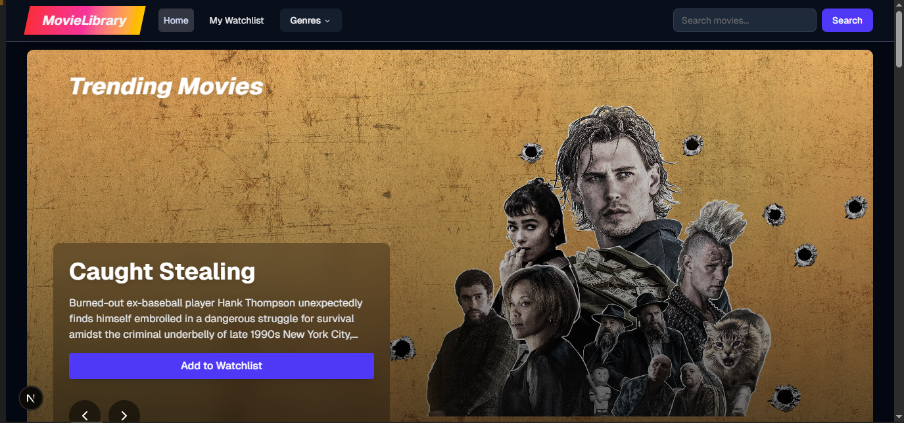

# 🎬 MovieLibrary

A modern web application for browsing movies and managing your personal watchlist. Built with Next.js 13+, TypeScript, and Tailwind CSS, MovieLibrary offers a sleek interface to discover trending movies, search for specific titles, and maintain a personalized watchlist.



## ✨ Features

- Browse trending movies with an auto-playing carousel
- Explore movies by genres (Action, Comedy, Drama, Horror, Sci-Fi)
- Search movies with real-time suggestions
- Add/remove movies to/from your watchlist
- Persistent watchlist using localStorage
- Responsive design with mobile-first approach
- Loading states and error handling
- Toast notifications for user feedback

## 🚀 Getting Started

### Prerequisites

- Node.js 18+ 
- npm or yarn
- A TMDB API key (get it from [TMDB](https://www.themoviedb.org/documentation/api))

### Installation

1. Clone the repository:
```bash
git clone https://github.com/VishnuKaranth/MovieLibrary.git
cd MovieLibrary
```

2. Install dependencies:
```bash
npm install
# or
yarn install
```

3. Create a `.env` file in the root directory: (Note: Get your TMDB key from here: https://www.themoviedb.org/documentation/api)
```env
NEXT_PUBLIC_TMDB_API_KEY=your_tmdb_api_key_here
```

4. Start the development server:
```bash
npm run dev
# or
yarn dev
```

5. Open [http://localhost:3000](http://localhost:3000) in your browser

## 🧪 Testing

The project uses Jest and React Testing Library for testing. To run the tests:

```bash
# Run all tests
npm test

# Run tests in watch mode
npm test -- --watch

# Run tests with coverage
npm test -- --coverage
```

### Test Structure
- Component tests are located in `__tests__` directories next to the components
- Test files follow the naming convention: `ComponentName.test.tsx`

## 🏗 Project Structure

```
src/
├── app/                    # Next.js 13+ App Router pages
├── components/            # React components
│   ├── carousel/         # Movie carousel components
│   ├── genre/           # Genre-specific components
│   ├── moviecard/       # Movie card component
│   ├── search/          # Search components
│   └── watchlist/       # Watchlist components
├── hooks/               # Custom React hooks
├── lib/                 # Utility functions and API
└── styles/             # Global styles
```

## 🎯 Design Choices & Assumptions

### Architecture
- Used Next.js 13+ App Router for modern routing and server components
- Implemented React Context for global state management
- Created reusable components for consistency
- Used OOP principles with service classes for API interactions

### State Management
- Watchlist state managed through React Context
- Local storage for persistence
- Real-time state updates with optimistic UI

### UI/UX
- Dark theme for better movie browsing experience
- Loading skeletons for better perceived performance
- Toast notifications for user feedback
- Responsive design for all screen sizes

### API Integration
- TMDB API for movie data
- Error handling for failed API calls
- Debounced search to prevent API spam
- Image optimization using TMDB's different image sizes

### Performance
- Lazy loading of images
- Debounced search
- Memoized components where beneficial
- Client-side caching of watchlist data

## 🛠 Technologies Used

- Next.js 13+
- TypeScript
- Tailwind CSS
- React Testing Library
- Jest
- Embla Carousel
- Lucide Icons
- Sonner (Toast notifications)

## 🤝 Contributing

Contributions, issues, and feature requests are welcome!

1. Fork the Project
2. Create your Feature Branch (`git checkout -b feature/AmazingFeature`)
3. Commit your Changes (`git commit -m 'Add some AmazingFeature'`)
4. Push to the Branch (`git push origin feature/AmazingFeature`)
5. Open a Pull Request
